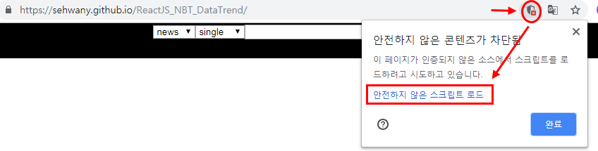

BigData Api & ReactJS project
-------------
☞☞☞ [viewing in GithubPage](https://sehwanY.github.io/ReactJS_NBT_DataTrend)

### news,blog,twitter = NBT_DataTrend
- [ADAMs API](http://adams.ai) 
- ReactJS
- [Mareial-UI](https://www.npmjs.com/package/@material-ui/core)
- [responsive-Modal](https://github.com/pradel/react-responsive-modal)
- [react-chartjs-2](https://github.com/jerairrest/react-chartjs-2)
- [~ing : Expected to be optimized Nov. 8 (Source code, function, etc.)](#)

## Multiple keyword search
## Graph view of trend data(Number of searches)